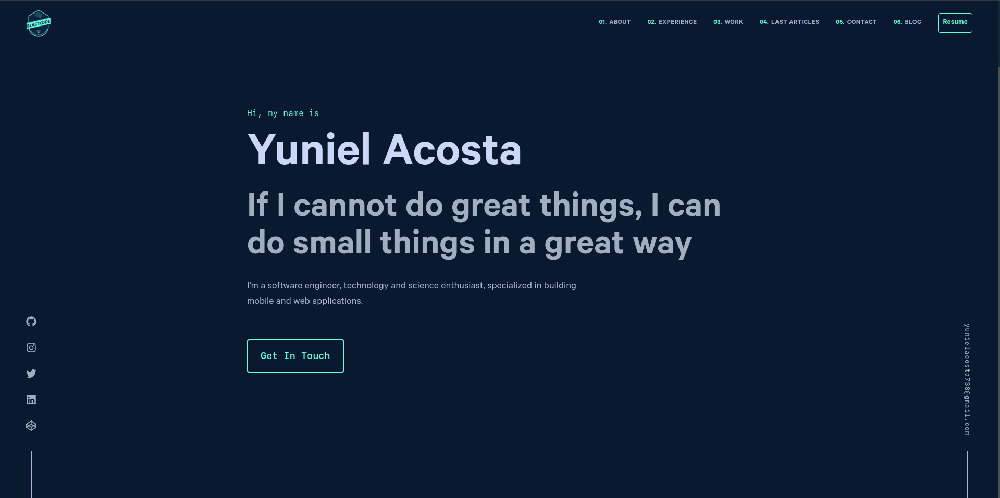

# Gridsome Portfolio Starter

A simple portfolio starter theme for Gridsome

## Demo URL

[https://blastkode.com](https://blastkode.com)

## Features

- Clean and minimal design
- [Tailwind CSS v2](https://tailwindcss.com) (with PurgeCSS). Using [this gridsome plugin](https://gridsome.org/plugins/gridsome-plugin-tailwindcss).
- Scroll to sections using [vue-scrollto](https://github.com/rigor789/vue-scrollto)
- Blog with markdown content for posts
- Documentation type that shows how to use Vue components in Markdown (click Docs)
- Theme Switcher with Dark Mode
- Search posts with [Fuse.js](https://fusejs.io)
- Tags for posts
- Basic pagination
- Syntax highlighting with [Shiki](https://shiki.matsu.io) (using [this gridsome plugin](https://gridsome.org/plugins/gridsome-plugin-remark-shiki))
- 404 Page
- RSS Feed
- Sitemap in XML

## Installation

1. Install Gridsome CLI tool if you don't have it: `npm install --global @gridsome/cli`
1. Clone the repo: `git clone https://github.com/yacosta738/blastkode`
1. `cd blastkode`
1. `npm install` (This can be a long download because of Cypress. If you don't care about testing with Cypress, remove it from `package.json`)
1. `gridsome develop` to start a local dev server at `http://localhost:8080`

## Testing

I have some basic end-to-end tests using [Cypress](https://cypress.io). You can find them in `/cypress/integration/tests.js`.

To run tests, first make sure your dev server is running with `gridsome develop`. I'm assuming you're using the default port of 8080. If not, change the `baseUrl` key in the `cypress.json` file.

After your dev server is running, you can run `npm run test` or `./node_modules/.bin/cypress open` to start Cypress. The Cypress electron app will run. Click the `tests.js` file and the tests will run in an automated browser.
