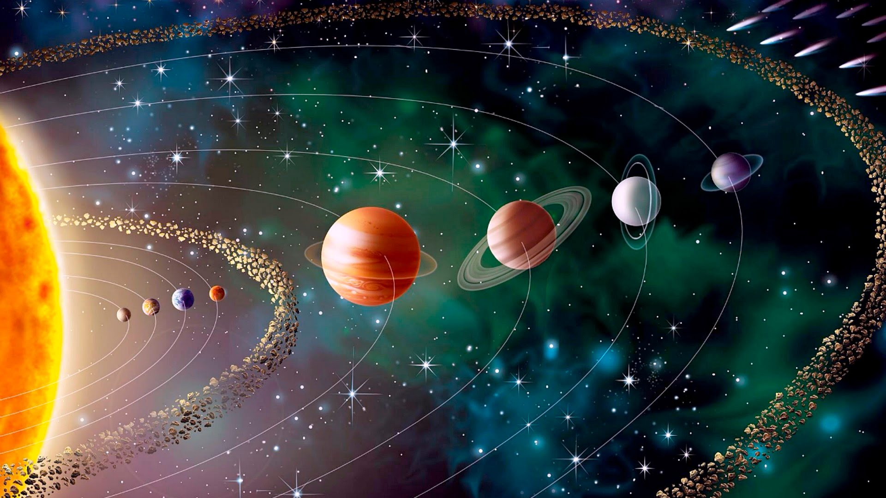
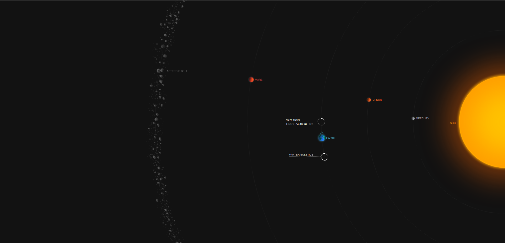

Astronomy and programming are two of my passions that this time I have decided to join together. With this objective in mind, we will create a simple website to count down how many days until the new year, simulating the movement of the planet earth. The demo can be seen at the following link [https://yacosta738.github.io/countdown-to-new-year/](https://yacosta738.github.io/countdown-to-new-year/)

Lo primero es crear un fichero **`style.css`** donde se define el estilo y la órbita de cada planeta:

~~~css
    html {
    box-sizing: border-box;
}

html *,
html *:before,
html *:after {
    box-sizing: inherit;
}

body {
    display: flex;
    justify-content: center;
    align-items: center;
    width: 100vw;
    height: 100vh;
    overflow: hidden;
    font-size: 62.5%;
    background-color: #121212;
    font-family: Arial, Helvetica, sans-serif;
    margin: 0;
    padding: 0;
}

.solar-system {
    position: relative;
    width: 100%;
    max-width: 700px;
    padding-top: 100%;
    right: -50%;
}

@media (min-width: 700px) {
    .solar-system {
        padding-top: 700px;
    }
}

/*** ORBITS ***/

.orbit {
    position: absolute;
    top: 50%;
    left: 50%;
    border: 2px dotted rgba(84 84 84 / 15%);
    border-radius: 100%;
    transform: translate(-50%, -50%);
}

.orbit-sun {
    width: calc(50%);
    height: calc(50%);
    border: 1px dotted #ff6600;
    background: #ffcc00;
}

.orbit-sun:before {
    content: "";
    background: #ff660017;
    width: 99%;
    height: 99%;
    display: block;
    margin-left: 0.5%;
    margin-top: 0.5%;
    border-radius: 100%;
    box-shadow: 0 0 10em 5em #ff66006b, 0 0 100px 50px #ff66006b inset, 0 0 10px 5px #ffcc00f2;
}

.orbit.orbit-sun:after {
    content: "SUN";
    color: #ffa200;
    top: 50%;
    position: absolute;
    left: -3.5em;
}

.orbit-mercury {
    width: calc(100%);
    height: calc(100%);
    transform: translate(-50%, -50%);
}

.orbit-venus {
    width: calc(150%);
    height: calc(150%);
    transform: translate(-50%, -50%);
}

.orbit-earth {
    width: calc(200%);
    height: calc(200%);
}

.orbit-earth:after {
    content: "";
    border: 2px solid red;
    width: 1em;
    height: 1em;
    display: block;
    position: relative;
    border-color: #54cbeb #54cbeb transparent transparent;
    transform: rotate(-50deg);
    border-width: 2px 2px 0 0;
    top: 52.75%;
    left: -0.5em;
    -webkit-animation: blinker 2s linear infinite;
    animation: blinker 2s linear infinite;
}

.orbit-mars {
    width: calc(280%);
    height: calc(280%);
    transform: translate(-50%, -50%);
}

.orbit-asteroids {
    width: calc(380%);
    height: calc(380%);
    transform: translate(-50%, -50%) rotate(0deg);
}

/*** PLANETS ***/

.planet {
    position: absolute;
    top: 50%;
    border-radius: 100%;
    opacity: 0;
    transform: translateY(-50%);
    transition: opacity 0s ease 0s;
}

.planet-mercury {
    left: -6px;
    width: 10px;
    height: 10px;
    transition-duration: 1s;
    background: #bcc1c9;
}

.planet-venus {
    left: -8px;
    width: 14px;
    height: 14px;
    transition-duration: 2s;
    background: #ec5f24
}

.planet-earth {
    left: -13px;
    width: 24px;
    height: 24px;
    transition-duration: 3s;
    z-index: 1;
}

.planet-mars {
    left: -9px;
    width: 18px;
    height: 18px;
    transition-duration: 4s;
    background: #d83e3c;
}

.planet-asteroids {
    left: -38px;
    width: 308px;
    height: 1500px;
    transition: all 5s ease 0s;
}

.planet-mercury:before {
    content: "MERCURY";
    color: #bcc1c9;
    margin-left: 15px;
    top: 0px;
    position: absolute;
    height: 10px;
    line-height: 10px;
}

.planet-venus:before {
    content: "VENUS";
    color: #ec5f24;
    margin-left: 21px;
    top: 1px;
    position: absolute;
    height: 14px;
    line-height: 14px;
}

.planet-earth:before {
    content: "EARTH";
    color: #54cbeb;
    margin-left: 29px;
    top: 1px;
    position: absolute;
    height: 24px;
    line-height: 24px;
}

.planet-mars:before {
    content: "MARS";
    color: #d83e3c;
    margin-left: 23px;
    top: 1px;
    position: absolute;
    height: 18px;
    line-height: 18px;
}

.planet-asteroids:before {
    content: "ASTEROID BELT";
    color: #666666;
    margin-left: 8em;
    top: 36.75%;
    position: absolute;
}

.planet-mars:after, .planet-venus:after, .planet-mercury:after, .planet-earth:after {
    content: "";
    background: linear-gradient(105deg, rgba(0, 0, 0, 1), rgba(0, 0, 0, 0.6), transparent, transparent);
    display: block;
    width: 100%;
    height: 100%;
    border-radius: 100%;
    box-shadow: 0 0 3px 2px #ffffff26;
    opacity: 0.8;
    position: absolute;
    top: 0;
    left: 0;
}

.planet-earth:after {
    box-shadow: 0 0 5px 3px #54cbeb5c;
}

.planet img {
    width: 100%;
}

/*** SELECTED DAYS ***/

.new-year-line, .winter-solstice-line {
    width: 12em;
    border-bottom: 2px dotted white;
    position: absolute;
    left: -13.35em;
    top: 50%;
    z-index: -1;
    color: white;
    margin-top: -13px;
    margin-left: -50%;
    height: 14px;
    line-height: 1em;
}

.new-year-line:after, .winter-solstice-line:after {
    content: "";
    width: 28px;
    height: 28px;
    display: block;
    float: right;
    position: absolute;
    background: #ffffff00;
    right: -28px;
    top: -1px;
    border: 2px dotted #fff;
    border-radius: 100%;
}

.winter-solstice-line {
    margin-top: 120px;
    left: -12.05em;
}

#cronoNewYear, #cronoWinterSolstice {
    left: 0;
    position: absolute;
    color: #fff;
    width: 100%;
    bottom: -17px;
    font-size: 1.1em;
}

#cronoNewYear span, #cronoWinterSolstice span {
    font-size: 0.75em;
    color: #666;
}

/*** WARNING ***/

#warning {
    position: fixed;
    left: 2em;
    bottom: 2em;
    background: rgb(0 0 0 / 0.75);
    height: 5em;
    width: 45em;
    font-size: 1.35em;
    color: #ffa200;
    z-index: 3;
    text-transform: uppercase;
    padding: 0;
    text-align: center;
    display: flex;
    justify-content: center;
    align-items: center;
}

#warning:before {
    content: " ! ";
    z-index: 2;
    font-size: 1.9em;
    margin-left: 1.15em;
    color: #ffa200;
    font-weight: bold;
    margin-top: 5px;
}

#warning:after {
    content: "";
    background: #ffa200;
    position: absolute;
    left: 0;
    width: 5em;
    height: 5em;
    z-index: 0;
}

#warning p {
    display: block !important;
    float: left;
    width: 100%;
    margin: 0 !important;
    padding-left: 2.5em;
}

#warning p:before {
    content: "";
    position: absolute;
    z-index: 1;
    border: 1.75em solid transparent;
    border-bottom: 2.85em solid #040404;
    left: 0.775em;
    top: -0.75em;
}

#reload {
    background: rgb(255 162 0);
    border: 0;
    border-radius: 1px;
    padding: 0.5em 0.75em;
    margin-left: 1.5em;
    cursor: pointer;
    outline: none;
}

#reload:hover {
    background: #54cbeb;
}

/* ANIMATIONS */

@-webkit-keyframes blinker {
    0% {
        opacity: 0;
        top: 52.85%;
    }
    40% {
        opacity: 1;
        top: 51%;
    }
    50% {
        opacity: 0;
        top: 51%;
    }
    60% {
        opacity: 1;
        top: 51%;
    }
    100% {
        opacity: 0;
        top: 48.25%;
    }
}

@keyframes blinker {
    0% {
        opacity: 0;
        top: 52.85%;
    }
    40% {
        opacity: 1;
        top: 51%;
    }
    50% {
        opacity: 0;
        top: 51%;
    }
    60% {
        opacity: 1;
        top: 51%;
    }
    100% {
        opacity: 0;
        top: 48.25%;
    }
}

@-webkit-keyframes spin {
    from {
        transform: rotate(0deg)
    }
    to {
        transform: rotate(-360deg);
    }
}

@keyframes spin {
    from {
        transform: rotate(0deg)
    }
    to {
        transform: rotate(-360deg);
    }
}
~~~
Then we create the file **`script.js`** where all the logic is defined to calculate the number of days left for the new year:

~~~js
//prevent loading error
document.getElementById('warning').remove();

//short getElementById
elem = function (id) {
    return document.getElementById(id);
}

//count until date
const newYearDate = new Date(`Jan 1, ${new Date().getFullYear() + 1} 00:00:00`).getTime();

//title angles
const todayDate = new Date().getTime();
const todaySecondsLeft = (newYearDate - todayDate) / 1000;
const todayDays = parseInt(todaySecondsLeft / 86400);
const randMer = Math.floor(Math.random() * (4 - 1 + 1)) + 1;
const randVen = Math.floor(Math.random() * (10 - 4 + 1)) + 4;
const randMar = Math.floor(Math.random() * (16 - 8 + 1)) + 8;
const style = document.createElement('style');
style.innerHTML = '.orbit-mercury {transform: translate(-50%, -50%) rotate(' + randMer + 'deg)} .orbit-venus {transform: translate(-50%, -50%) rotate(' + randVen + 'deg)} .orbit-mars {transform: translate(-50%, -50%) rotate(' + randMar + 'deg)} .planet-mercury {transform:rotate(-' + randMer + 'deg)} .planet-venus {transform:rotate(-' + randVen + 'deg)} .planet-mars {transform:rotate(-' + randMar + 'deg)} .planet-earth {transform:rotate(' + todayDays + 'deg)} .planet-venus {transform:rotate(-' + randVen + 'deg)} ';
document.head.appendChild(style);

//countdown vars
let days, hours, minutes, seconds;

//countdown
const countDown = setInterval(function () {

    const rightNow = new Date().getTime();
    const timeTo = newYearDate - rightNow;

    days = Math.floor(timeTo / (1000 * 60 * 60 * 24));
    hours = Math.floor((timeTo % (1000 * 60 * 60 * 24)) / (1000 * 60 * 60));
    minutes = Math.floor((timeTo % (1000 * 60 * 60)) / (1000 * 60));
    seconds = Math.floor((timeTo % (1000 * 60)) / 1000);

    if (hours < 10) hours = "0" + hours;
    if (minutes < 10) minutes = "0" + minutes;
    if (seconds < 10) seconds = "0" + seconds;

    elem("cronoNewYear").innerHTML = days + " DAYS &nbsp;" + hours + ":" + minutes + ":" + seconds + " LEFT";
    let newDays;
    if (days < 0) {
        elem("cronoNewYear").style.display = 'none';
        newDays = days.toString().substr(1);
    } else {
        newDays = "-" + days;
    }
    elem("position-earth").style.transform = 'translate(-50%, -50%) rotate(' + newDays + 'deg';

    let solsDays;
    const cDays = days - 11;
    if (cDays < 0) {
        elem("cronoWinterSolstice").style.display = 'none';
    } else {
        solsDays = cDays
    }
    elem("cronoWinterSolstice").innerHTML = solsDays + " DAYS &nbsp;" + hours + ":" + minutes + ":" + seconds + " LEFT";

    const opacityList = document.querySelectorAll('.planet');
    for (let i = 0; i < opacityList.length; i++) {
        opacityList[i].style.opacity = '1';
    }

    if (timeTo < 0) {
        clearInterval(countDown);
    }

}, 1000);
~~~

Finally, a file **`index.html`** is created that will contain all the html code for our website. The html document begins with the definition of the document type followed by the language of the page, in the header section we find the title, some metadata as well as the import of the page styles. In the body of the document we make use of the classes created previously to be able to visualize the planets and their orbits. At the end we import the previously created javascript file:

~~~html
<!DOCTYPE html>
<html lang="en">
<head>
    <meta charset="UTF-8">
    <title>Countdown to New Year </title>
    <link rel="stylesheet" href="https://cdnjs.cloudflare.com/ajax/libs/normalize/5.0.0/normalize.min.css">
    <link rel="stylesheet" href="./style.css">

</head>
<body>
<!-- partial:index.partial.html -->

    

    

        

            
        

    

    

        

            
        

    

    

        

            
        

    

    

        

            
        

    

    

        

            
        

    

    
NEW YEAR 

    
WINTER SOLSTICE 

    
it seems that the earth has gone out of its orbit...
        <button id="reload" onclick="location.reload()">RE-ORBIT</button>
    

<!-- partial -->

</body>
</html>

~~~

~[Project Structure](./images/project-structure.png)
All the code can be downloaded from GitHub at the following link [https://github.com/yacosta738/countdown-to-new-year](https://github.com/yacosta738/countdown-to-new-year)

