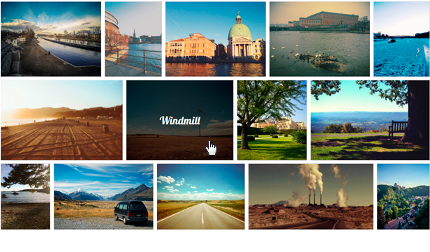
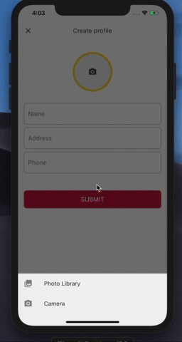

The image picker is a common component that is often needed to change user profile photos among many other options where an image needs to be uploaded. In order to provide our application with the option to upload selected images from our device, either in the camera or the gallery, we will use the [plugin](https://pub.dev/packages/image_picker) made by developers of Flutter.

## **Step 1**: Add dependency to **_pubspec.yaml_** file.

    image_picker: ^0.6.7+14

## **Step 2**: Configure native platforms

Next, we need to configure the native settings. For the Android platform, nothing needs to be configured. For iOS, open the `Info.plist` file found in the` ios/Runner` folder and add the following keys.
~~~text
<key>NSPhotoLibraryUsageDescription</key>
<string>Allow access to photo library</string>

<key>NSCameraUsageDescription</key>
<string>Allow access to camera to capture photos</string>

<key>NSMicrophoneUsageDescription</key>
<string>Allow access to microphone</string>
~~~
## **Step 3**: Image selector function

In the `State` class of` StatefulWidget` on our screen, declare a variable of type `File` to contain the image chosen by the user.

    File _image;

Now write two functions to select images via camera and photo gallery respectively. The optional parameter `imageQuality` accepts any value between 0 and 100, this parameter can be adjusted according to the size and quality required by the application. After getting the image file, we save it in the variable `_image` and call` setState() `so that it can be displayed on the screen.

~~~dart
    _imgFromCamera() async {
    File image = await ImagePicker.pickImage(
        source: ImageSource.camera, imageQuality: 50
    );
  
    setState(() {
      _image = image;
    });
  }
  
  _imgFromGallery() async {
    File image = await ImagePicker.pickImage(
        source: ImageSource.gallery, imageQuality: 50
    );
  
    setState(() {
      _image = image;
    });
  }
~~~

## **Step 4**: Create an option selector to select the camera or gallery

Next, we observe the function to show a `bottom sheet` for the user to choose the camera or gallery option.

~~~dart
void _showPicker(context) {
  showModalBottomSheet(
      context: context,
      builder: (BuildContext bc) {
        return SafeArea(
          child: Container(
            child: new Wrap(
              children: <Widget>[
                new ListTile(
                    leading: new Icon(Icons.photo_library),
                    title: new Text('Photo Library'),
                    onTap: () {
                      _imgFromGallery();
                      Navigator.of(context).pop();
                    }),
                new ListTile(
                  leading: new Icon(Icons.photo_camera),
                  title: new Text('Camera'),
                  onTap: () {
                    _imgFromCamera();
                    Navigator.of(context).pop();
                  },
                ),
              ],
            ),
          ),
        );
      }
  );
}
~~~

## **Step 5**: Create and configure screen image view
Finally, let's create a profile image bracket on the screen, which opens the selector when clicked and displays the selected image.

~~~dart
@override
Widget build(BuildContext context) {
  return Scaffold(
    appBar: AppBar(),
    body: Column(
      children: <Widget>[
        SizedBox(
          height: 32,
        ),
        Center(
          child: GestureDetector(
            onTap: () {
              _showPicker(context);
            },
            child: CircleAvatar(
              radius: 55,
              backgroundColor: Color(0xffFDCF09),
              child: _image != null
                  ? ClipRRect(
                borderRadius: BorderRadius.circular(50),
                child: Image.file(
                  _image,
                  width: 100,
                  height: 100,
                  fit: BoxFit.fitHeight,
                ),
              )
                  : Container(
                decoration: BoxDecoration(
                    color: Colors.grey[200],
                    borderRadius: BorderRadius.circular(50)),
                width: 100,
                height: 100,
                child: Icon(
                  Icons.camera_alt,
                  color: Colors.grey[800],
                ),
              ),
            ),
          ),
        )
      ],
    ),
  );
}

~~~

Done, run the app, and you should see something like this.

